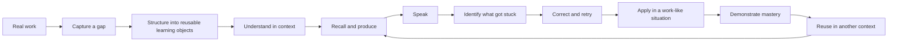
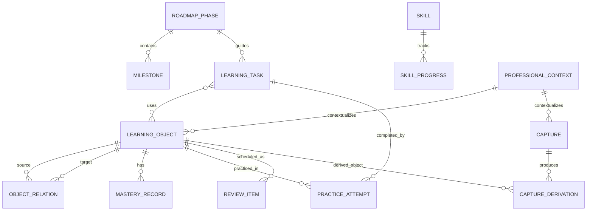
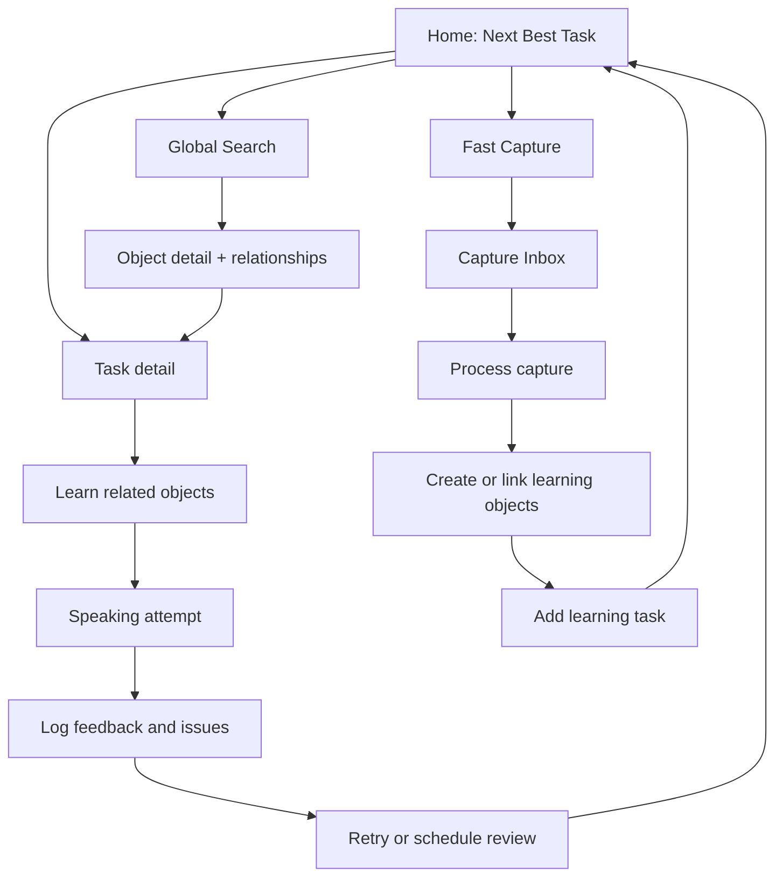

# Product Design English System — Product Architecture v0.1

Status: **Architecture proposal — implementation pending approval**

## 1. Product goal

### Product promise

Turn existing Product Design knowledge and real work experience into English that can be used to explain, present, discuss, challenge, defend, and collaborate.

This is a professional communication system, not a general English course. The primary outcome is **real-time professional communication** in familiar Product Design contexts.

### Primary user

A Product Designer with strong domain knowledge, approximately TOEIC 600 English, and limited English use at work. The user works mainly in:

1. Data-driven media product design
2. Complex systems, BPM, and AI-assisted product design

### Job to be done

> When I encounter a Product Design situation that I cannot express clearly in English, help me capture it, turn it into reusable language and practice, and revisit it until I can use it independently in a real discussion.

### Product success

Success is demonstrated by performance, not collection size:

- Can explain a familiar product problem clearly.
- Can connect evidence to a decision without overstating certainty.
- Can explain rationale, constraints, alternatives, and trade-offs.
- Can understand and answer follow-up questions.
- Can reuse learned language in a new work situation.
- Can move from prepared speaking to independent real-time discussion.

### Non-goals

- Test preparation, academic English, or native-like fluency
- Maximizing vocabulary count, study hours, or streaks
- A generic chatbot or content-heavy course library
- Grammar perfection unrelated to professional communication

### Product decision filter

Every core feature must answer yes to:

> Does this help transform Product Design knowledge into usable English professional communication?

## 2. Learning model and product loop

### Core loop



### The unit of learning

The system does not treat a word, grammar topic, or speaking prompt as an isolated lesson. A **Learning Cluster** connects objects around one real communication need.

Example cluster: “The available data cannot establish causality.”

- Vocabulary: reliable baseline, traffic decline, fluctuate
- Pattern: We don't have enough evidence to conclude that ___ caused ___.
- Grammar: conclude that + clause; cause + object; hedging
- Speaking task: Explain why the current evidence is insufficient.
- Skill: Data Explanation / Express Uncertainty
- Source: a real post-launch observation

The cluster is a computed relationship view, not a second copy of content.

### Mastery model

All learnable objects use one consistent progression:

1. `not_started`
2. `learning`
3. `can_understand`
4. `can_use_with_preparation`
5. `can_use_independently`
6. `automatic`

Mastery must be supported by evidence. Viewing an item cannot move it beyond `learning`. Independent production is required for level 5; successful use in an interactive or real-work context is required for level 6.

## 3. Core user flows

### Flow A — Start the day: decide what matters now

1. Open Home.
2. See one primary recommendation: **Next Best Task**.
3. See why it is recommended: current phase, weakness, due review, or current work context.
4. Start or defer it.
5. Complete a short production activity and record the result.

Home is a decision surface, not a reporting dashboard.

### Flow B — Capture something from real work

1. Open Fast Capture from any screen.
2. Choose or infer capture type: word, sentence, couldn't say, couldn't understand, work situation, useful expression.
3. Enter raw text in Chinese or English; optionally add work context.
4. Save immediately to Inbox with minimal required fields.
5. Later, process the capture into vocabulary, patterns, grammar links, and speaking tasks.
6. Add resulting objects to a Learning Cluster and backlog.

MVP rule: capture must not require completing the full content schema. AI extraction is reserved for a later phase; the data structure supports suggestions and human confirmation.

### Flow C — Learn a reusable pattern

1. Open a pattern from a task, search result, cluster, or related object.
2. Understand intent, meaning, slots, and a real work example.
3. Review related vocabulary and one focused grammar note.
4. Produce a new sentence.
5. Use it in a speaking prompt.
6. Record attempt, feedback, and retry status.

### Flow D — Practice speaking

1. Select a task matched to current level and target skill.
2. Prepare with required vocabulary, patterns, and key points.
3. Speak within the target duration.
4. Save notes or recording reference.
5. Log issues: grammar, missing vocabulary, structure, hesitation.
6. Create focused follow-up tasks and retry.

### Flow E — Review for transfer

1. Open Due for Review.
2. Complete the next review stage: recognition, recall, completion, original sentence, speaking, or interactive application.
3. Record result and confidence.
4. Advance, maintain, or reduce mastery based on evidence.
5. Schedule the next review by performance and stage.

## 4. Information architecture

```text
Home
├── Next Best Task
├── Current Phase and Goal
├── This Week / Continue Learning
├── Due for Review
├── Speaking Practice
├── Current Weakness
├── Recent Work Captures
└── Next Milestone

Learn
├── Vocabulary
├── Sentence Patterns
├── Grammar by Communication Intent
└── Learning Clusters

Practice
├── Speaking Tasks
├── Review Queue
└── Practice History

Plan
├── Roadmap
├── Learning Backlog
└── Skill Map

Capture
├── Quick Entry
└── Inbox / Needs Processing

Library (future)
├── Professional Q&A
├── Story Bank
├── Case Studies
└── Challenge Sessions

Settings
├── Current Professional Context
├── Learning Preferences
└── Content Import / Export
```

### Global navigation

Keep five primary destinations: **Home, Learn, Practice, Plan, Capture**. Search is global. Capture is a persistent action rather than a destination the user must navigate to first.

### Primary list behavior

Vocabulary, patterns, grammar, speaking tasks, backlog, and captures share consistent list conventions:

- Search
- Filter by context, skill, mastery, difficulty, status, and due state
- Sort by recommended, recent, due, or mastery
- Open relationships without losing the current context
- Bulk tagging is optional after MVP validation

## 5. Domain model

### Entity relationship overview



### Content entities

`LearningObject` is a shared envelope for lifecycle, search, tagging, provenance, and relationships. Type-specific fields live in dedicated records.

#### LearningObject

| Field | Type | Notes |
|---|---|---|
| id | UUID | Stable identifier |
| type | enum | vocabulary, pattern, grammar, speaking_task; future types reserved |
| title | string | Display and search label |
| summary | string nullable | Concise explanation |
| difficulty | 1–5 | Shared scale |
| status | enum | draft, active, archived |
| source_type | enum | real_work, professional_material, discussion, system_seed, ai_suggestion |
| source_note | text nullable | Provenance without duplicating capture |
| created_at / updated_at | timestamp | Lifecycle |

#### Vocabulary

`learning_object_id`, term, chinese_meaning, category, definition, professional_context, example_sentence, my_work_example, common_collocations[], related_terms_note, common_mistakes[], pronunciation_note.

#### SentencePattern

`learning_object_id`, communication_intent, pattern, chinese_meaning, simple_version, professional_version, example, my_work_example, replaceable_slots[], grammar_note, common_mistakes[], speaking_practice.

#### GrammarTopic

`learning_object_id`, communication_intent, professional_use, simple_explanation, product_example, my_work_example, common_mistakes[], speaking_exercise.

#### SpeakingTask

`learning_object_id`, topic, context, level, target_seconds_min, target_seconds_max, key_points[], instructions, definition_of_done.

### Relationship model

Use a typed join entity rather than hard-coded arrays on each object.

#### ObjectRelation

| Field | Type | Example |
|---|---|---|
| source_object_id | UUID | baseline |
| target_object_id | UUID | evidence-insufficient pattern |
| relation_type | enum | requires, practices, explains, applies_to, supports, contrasts_with, related_to |
| note | text nullable | Why the relation is useful |
| rank | integer nullable | Editorial ordering |

This permits future Q&A, stories, cases, and challenges to enter the same graph without changing existing entity schemas.

### Planning entities

#### RoadmapPhase

id, sequence, name, goal, skills[], prerequisites[], definition_of_done, status, progress_method, next_milestone_id.

#### Milestone

id, phase_id, title, description, definition_of_done, target_date nullable, status, completed_at nullable.

#### LearningTask

id, title, category, priority, status, difficulty, estimated_minutes, definition_of_done, review_date nullable, phase_id nullable, recommendation_reasons[], created_at, completed_at nullable.

Task-to-object and task-to-skill relationships use join tables. A task may practice several objects but should have one primary skill to keep its purpose clear.

#### Skill

id, name, category, description, parent_skill_id nullable, target_mastery, display_order.

#### SkillProgress

skill_id, mastery_level, confidence, evidence_count, last_demonstrated_at, current_weakness, next_action.

Skill progress is derived from recent qualifying attempts where possible; it is not merely a manually edited percentage.

### Learning evidence entities

#### PracticeAttempt

id, task_id nullable, primary_object_id nullable, practice_type, started_at, completed_at, duration_seconds nullable, user_notes, recording_uri nullable, transcript nullable, self_rating, outcome, feedback_summary, retry_required.

#### AttemptIssue

id, attempt_id, issue_type, description, related_object_id nullable, severity, resolved_at nullable.

Issue types include missing_vocabulary, grammar, structure, pronunciation, hesitation, comprehension, evidence_logic, and professional_tone.

#### MasteryRecord

id, object_id, level, evidence_type, attempt_id nullable, observed_at, confidence, note.

Keep mastery history rather than overwriting a single value. Current mastery is the latest valid level, with optional decay rules later.

#### ReviewItem

id, object_id, stage, due_at, status, interval_days, last_result, next_activity_type.

Review stages: recognition, recall, completion, original_production, speaking_application, interactive_application.

### Capture entities

#### Capture

id, capture_type, raw_text, language, professional_context_id nullable, source_note nullable, captured_at, status, processed_at nullable.

Capture status: inbox, processing, processed, dismissed.

#### CaptureDerivation

capture_id, learning_object_id, derivation_type, confirmation_status, note.

This creates traceability from raw work material to polished learning content and supports future AI suggestions without auto-publishing them.

### Context and taxonomy

#### ProfessionalContext

id, name, description, context_type, active.

Initial contexts:

- Data-driven Media Product
- BPM / Complex System
- AI-assisted Design Workflow

Use controlled taxonomies for communication intent, vocabulary category, issue type, and skill. Use normal tags only for flexible cross-cutting discovery. This avoids turning critical filters into inconsistent free text.

## 6. Recommended logical schema

```text
learning_objects
vocabulary_details
pattern_details
grammar_details
speaking_task_details
object_relations
object_contexts
object_tags

roadmap_phases
milestones
learning_tasks
task_objects
skills
task_skills
skill_progress

practice_attempts
attempt_issues
mastery_records
review_items

captures
capture_derivations
professional_contexts
tags

-- reserved for later phases
qa_details
story_details
case_study_details
challenge_sessions
challenge_turns
```

### Architecture rules

1. UI reads content through repository/service interfaces; it does not embed curriculum content.
2. Type-specific records extend a shared learning object; they do not duplicate shared fields.
3. Relationships are first-class data.
4. Raw captures remain immutable evidence; processing creates linked derived objects.
5. Attempts and mastery history are append-oriented.
6. Recommendation logic returns reasons, so “Next Best Task” is explainable.
7. AI output enters as a suggestion requiring confirmation, never as trusted source data.
8. Enum values are stable internal identifiers; display labels can be localized.

## 7. MVP scope

### Included

1. Roadmap: five phases, with Phase 1 actionable
2. Vocabulary library and detail
3. Sentence pattern library and detail
4. Grammar by communication intent
5. Speaking tasks with notes, issues, and retry
6. Learning backlog
7. Skill map and evidence-based mastery
8. Fast Capture inbox and manual processing
9. Search, essential filters, and cross-object relationships
10. Home with rule-based Next Best Task

### Deliberately excluded

- AI extraction, conversational coach, or automatic correction
- Audio transcription and pronunciation scoring
- Professional Q&A, Story Bank, and Case Study UI
- Interactive Challenge Mode
- Collaboration, sharing, or multi-user roles
- Gamification, streaks, social features, and generic content marketplace
- Complex spaced-repetition optimization

### MVP validation questions

- Does Fast Capture fit into real work with low enough friction?
- Can one captured situation become reusable across at least three learning object types?
- Does the user understand why the system recommends the next task?
- Does pattern-first practice improve a 1–3 minute explanation?
- Can the user find related language while preparing to speak?
- Is mastery evidence understandable and credible?

### MVP definition of done

- A user can capture an expression gap in under 30 seconds.
- A capture can be manually converted into connected vocabulary, pattern, grammar, and speaking objects.
- The user can complete a speaking attempt, log issues, and schedule a retry.
- Home recommends a relevant task using phase, due review, weakness, and active context.
- Search and relationships allow an object to be reused without duplicating content.
- Seed content supports both major professional tracks without pretending to be a complete curriculum.

## 8. Initial roadmap

### Phase 1 — Product English Foundation

- Goal: explain familiar work clearly for 3–5 minutes using core vocabulary and patterns.
- Skills: problem/context explanation, basic evidence language, current/past behavior, structured speaking.
- Tasks: learn core clusters, produce short explanations, log gaps, retry.
- Prerequisite: existing Product Design knowledge; no separate English prerequisite.
- Definition of done: two familiar topics delivered for 3–5 minutes each, using connected vocabulary and patterns with understandable grammar.
- Next milestone: explain why a reliable baseline matters and answer two follow-up questions.

### Phase 2 — Professional Product Communication

- Goal: explain evidence, rationale, trade-offs, and technical constraints.
- Definition of done: independently deliver structured explanations in Data and Complex System contexts and respond to prepared follow-ups.

### Phase 3 — Case Communication

- Goal: turn real projects into reusable professional stories and case presentations.
- Definition of done: present two cases in 3- and 10-minute versions and answer common questions.

### Phase 4 — Cross-functional Discussion

- Goal: clarify, disagree, negotiate scope, and collaborate in interactive discussion.
- Definition of done: complete role-based PM/Engineering discussions while maintaining clarity and professional tone.

### Phase 5 — Advanced Product Communication

- Goal: defend decisions and discuss complex product issues in real time.
- Definition of done: explain evidence, assumptions, alternatives, constraints, outcomes, and reflection under unprepared follow-up questions.

## 9. Next Best Task logic for MVP

Use a transparent rule-based score before introducing AI:

```text
score =
  due_review_weight
  + current_phase_weight
  + active_context_weight
  + weakness_weight
  + unfinished_task_weight
  + speaking_transfer_weight
  - recent_repetition_penalty
```

Constraints:

- Recommend at most one primary and three secondary tasks.
- Prefer production over another recognition task when prerequisites are met.
- Prefer a retry when the last attempt exposed a high-severity issue.
- Never recommend an advanced task whose required objects are below `can_understand`.
- Always show the recommendation reason in plain language.

## 10. Seed content strategy

Start with three high-quality Learning Clusters, not a large fake library:

1. **Insufficient evidence and baseline** — Data-driven Media Product
2. **Role permissions and edge cases** — BPM / Complex System
3. **AI-assisted design workflow and human review** — AI-assisted Design Workflow

Each cluster should contain roughly:

- 4–6 vocabulary items
- 2–3 sentence patterns
- 1 focused grammar topic
- 2 speaking tasks at different levels
- 2–3 backlog tasks
- links to 1–2 target skills

This is enough to test reuse, navigation, capture processing, search, review, and skill evidence without obscuring the architecture with volume.

## 11. Progressive expansion architecture

### Phase 2 additions

- Fast Capture processing assistance
- Multi-stage review activities
- Stronger evidence/rationale/trade-off/constraint content
- Rule-based correction templates and structured feedback

### Phase 3 additions

Add `qa`, `story`, and `case_study` as new LearningObject types. They reuse object relations, contexts, attempts, mastery, review, and tasks.

### Phase 4 additions

Add interactive sessions with role, scenario, turns, follow-up intent, issues, and session evidence. A challenge session can reference cases, stories, skills, and language objects.

### Phase 5 additions

Add AI services behind interfaces:

- Capture extraction service
- Language correction service
- Follow-up question generator
- Role-based challenge orchestrator
- Speaking feedback service

Store model input/output, version, user confirmation, and derived-object links. Do not couple core entities to one model provider.

## 12. First version screen flow



### Core screen inventory

1. Home / Next Best Task
2. Fast Capture overlay
3. Capture Inbox and Process Capture
4. Unified Library list with type-specific filters
5. Vocabulary detail
6. Pattern detail
7. Grammar detail
8. Speaking task / attempt
9. Review queue
10. Roadmap
11. Learning backlog
12. Skill map / skill detail

## 13. Decisions requiring confirmation before implementation

1. **Pattern-first default:** sentence patterns are the main learning object; vocabulary and grammar support production.
2. **Learning Cluster as a view:** clusters are assembled from relationships, not maintained as duplicated bundles.
3. **Mastery requires evidence:** progress is based on attempts and application, not manual completion alone.
4. **Capture first, process later:** the capture flow stays minimal; incomplete data is allowed in Inbox.
5. **Single-user local-first MVP:** no accounts or collaboration unless deployment needs require them.
6. **Rule-based recommendations first:** AI is not required to make Home useful.
7. **Three seed clusters only:** validate architecture and workflow before expanding content.

After these decisions are approved, implementation should proceed in this order:

1. Choose runtime and persistence based on intended deployment.
2. Create migrations/schema and repository interfaces.
3. Add the three seed clusters as data files or seed records.
4. Build Capture → Process → Object relationships.
5. Build Task → Speaking Attempt → Issue → Retry.
6. Build Home recommendation and Roadmap/Skill views.
7. Verify the complete loop with one scenario from each professional track.

